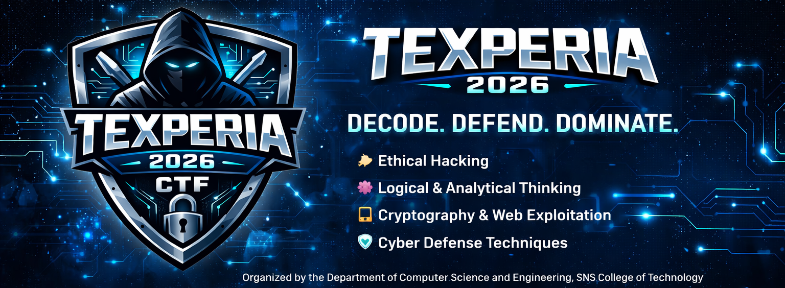

# 🔐 TEXPERIA 2026 – Capture The Flag (CTF)

TEXPERIA 2026 is an elite **National-Level Capture The Flag (CTF) Cybersecurity Challenge** organized by the **Department of Computer Science and Engineering, SNS College of Technology**.

This competition is designed to test participants in:

- 🔐 Ethical Hacking  
- 🧠 Logical & Analytical Thinking  
- 💻 Cryptography & Web Exploitation  
- 🛡️ Cyber Defense Techniques  

Participants will compete in teams to solve real-time security challenges and capture hidden flags by decoding, defending, and exploiting vulnerabilities.

> 🚀 **Decode. Defend. Dominate.**  
> It’s not just a competition — it’s a battlefield for future cybersecurity experts.

---

## 🏆 About TEXPERIA 2026

TEXPERIA 2026 is a national-level technical fest conducted by the **Department of Computer Science and Engineering, SNS College of Technology**.

The fest brings together innovative minds from various institutions to compete, collaborate, and showcase their technical skills through:

- 💻 Technical Events  
- 🧩 Coding Challenges  
- 🛡️ Cybersecurity Battles  
- 🧠 Brainstorming Competitions  

Our mission is to create a platform where students can enhance their knowledge, gain practical exposure, and connect with like-minded tech enthusiasts.

✨ *Where innovation meets competition.*

---

## 🎯 Event Theme

**CAPTURE THE FLAG (CTF)**

---

## 💰 Registration Details

- **Registration Fee:** ₹400  
- **Certificates:** Provided to all participants  

---

## 📞 Contact Information

For queries, contact:

- 📲 Girisanth S – 9894731154  
- 📲 Manobharathi G – 9025504175  

---

## 📁 Repository Purpose

This repository hosts the official challenges, materials, and event resources for the TEXPERIA 2026 CTF competition.

---

© Suriya Gayathri | 2026 TEXPERIA | Department of Computer Science and Engineering  
SNS College of Technology
